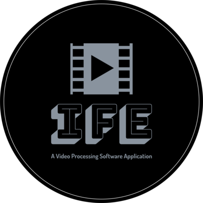

<div align="center">
<h1>
  <span style="color: brown; font-family: sans-serif">IFE -</span> <span style="color: brown">I</span>ntelligent <span style="color: brown">F</span>rame <span style="color: brown">E</span>xtractor
</h1>


# Overview
The Intelligent Frame Extractor (IFE) is a software application developed by the Chair of Computer Engineering to support the needs of projects conducted at the Indoor Flight Center (IFC). As a data processing tool, IFE specializes in the analysis of video frames using various object detection algorithms. The application excels in its ability to process and save results through data serialization techniques.
> ***Main Features***<br>
Data Analysis<br>
Image Processing<br>
Media Features

# Required Steps
First, install the required packages to run this application using the command below. All the packages and libraries are stored in the requirements.txt file.
```console
pip install -r requirements.txt
```

After installing all the required packages now it's time to build the application. To build the application, go to the terminal and run:

**For Windows**:
```console
python main.py
```
**For MacOS and Unix**:
```console
python3 main.py
```

# Project Files And Folders Structure

<div align="left">

> **main.py**: Entry file for this application.
> 
> **mainwindow.ui**: Qt Design file for main window. 
> To convert the design file to auto generated python file use the command below which comes with PySide6 library.
> ```console
> pyside6-uic mainwindow.ui> mainwindow.py 
> ```
> 
> **resources/resources.qrc**: Add here resource files for using Qt Designer. "resource.qrc" file can be converted to python using the command below.
> ```console
> pyside6-rcc resources.qrc -o resources_rc.py
> ```
> **setup.py**: This file is responsible for building executable files for different OS.
> 
> **.gitignore**: It contains the list of files and folders which is not relevant for git repository.
> 
> **application/**: This folder contains the basic configuration files for the whole application.
> 
> **resources/**: All the icons, images, theme css files are stored here.
> 
> **widgets/**: Different widgets(components) are defined here.
</div>

# Integrating YOLOv5 Model
There are two ways to integrate YOLO models within this application. First way would be, directly cloning the repository from ultralytics into the application.

```console
git clone https://github.com/ultralytics/yolov5
```
```console
cd yolov5
```
```console
pip install -U -r requirements.txt
```

Second way, use packaged yolov5 model using pip. It will download the repository from https://github.com/fcakyon/yolov5-pip. To add this we can use the command below.
```console
pip install yolov5
```


# Application Packaging (cx_Freeze)
***cx_Freeze*** normally produces a folder containing an executable file for your program, along with the shared libraries (DLLs or .so files) needed to run it. You can make a simple Windows installer using a setup script with the bdist_msi option, or a Mac disk image with bdist_dmg.

Details: https://cx-freeze.readthedocs.io/en/6.10/index.html

***Installation***

In a virtual environment, install by issuing the command:

> pip install --upgrade cx_Freeze

***Commands***
> python setup.py build

> python setup.py bdist_msi

*On Mac OS X, we can use bdist_dmg to build a Mac disk image. It creates an application bundle, then packages it into a DMG disk image suitable for distribution and installation.

> python setup.py bdist_mac

*This command is available on Mac OS X systems, to create a Mac application bundle (a .app directory).
</div>